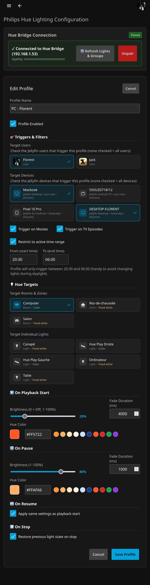

# Jellyfin Philips Hue Plugin

[](https://github.com/florentsorel/jellyfin-hue/actions/workflows/build.yaml)
[](https://github.com/florentsorel/jellyfin-hue/actions/workflows/test.yaml)
[](LICENSE)

A native **Philips Hue** integration plugin for **Jellyfin 12+** that automatically synchronizes your room lighting with media playback states (smooth cinema dimming, warm pause illumination, and state restoration on stop).

---

## ✨ Features

- **Philips Hue CLIP API v2**:
  - Direct local HTTPS communication with the bridge.
  - Automatic cloud discovery (`discovery.meethue.com`) and local IP configuration.
  - Secure push-button pairing directly from the Jellyfin administration dashboard.
- **Multi-Profile System**:
  - Create distinct profiles for different rooms, screens, or family members.
  - **Filter by Users**: Target all Jellyfin users or specific profiles.
  - **Filter by Devices / Clients**: Target specific device IDs or client apps (e.g., Living Room TV, Bedroom Apple TV).
  - **Filter by Media Type**: Enable separately for Movies and TV Series (excludes music/photos).
  - **Filter by Time Range**: Restrict profile triggers to specific active hours (e.g., 20:30 to 06:00) to avoid turning on lights during daylight.
- **Customizable Playback Actions**:
  - **Play**: Smooth cinema fade down to custom brightness (or complete blackout).
  - **Pause**: Instant or soft warm glow (customizable color / white temperature & brightness) for getting up comfortably.
  - **Resume**: Seamless return to dark viewing atmosphere.
  - **Stop**: Option to restore previous light state or turn on ambient lighting.
- **Target Selection & Bulb Support**:
  - Control Hue Rooms, Entertainment Zones, or individual lamps.
  - Full support for **Color**, **Tunable White Ambiance** (color temperature), and **Fixed White** bulbs.
  - Live simulation and test action buttons to verify transitions and color setups in real time.

---

## 📸 Screenshot

<p align="center">
  
</p>

---

## 🚀 Installation

### Via Jellyfin Plugin Repository
1. In Jellyfin, navigate to **Dashboard** > **Plugins** > **Repositories**.
2. Add this repository URL:
   ```text
   https://raw.githubusercontent.com/florentsorel/jellyfin-hue/master/manifest.json
   ```
3. Go to **Catalog**, find **Philips Hue**, and click **Install**.
4. Restart your Jellyfin server.

---

## 🛠️ Configuration

1. In the Jellyfin Dashboard, open **Philips Hue** in the left sidebar under Plugins / Extensions.
2. Click **Auto Discover** to find your bridge, or manually input your Bridge IP address.
3. Press the physical **Link Button** on top of your Philips Hue Bridge, then immediately click **Pair Bridge** in the UI.
4. Once paired, click **Add Profile** to configure your lighting rules:
   - Choose target users and devices.
   - Select your target Hue rooms, zones, or lamps.
   - Configure brightness levels and transition times (in milliseconds).
5. Use the **Test Action** button on any profile to send a quick pulse test to the selected lamps.

---

## 🏷️ Versioning Strategy

This repository aligns its versions directly with Jellyfin targets:
- **Jellyfin 12+ (.NET 10)**: `master` branch -> Releases `12.x.x.x`
- **Jellyfin 10.11 (.NET 9)**: `v10.x` branch -> Releases `10.x.x.x`

---

## 📜 License

This project is licensed under the [GNU General Public License v3.0](LICENSE).
